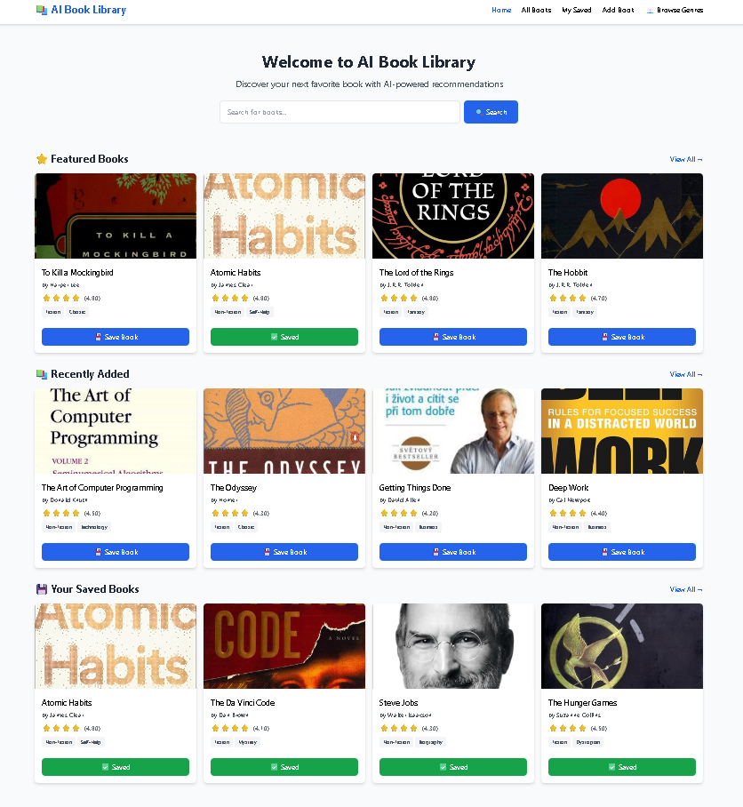
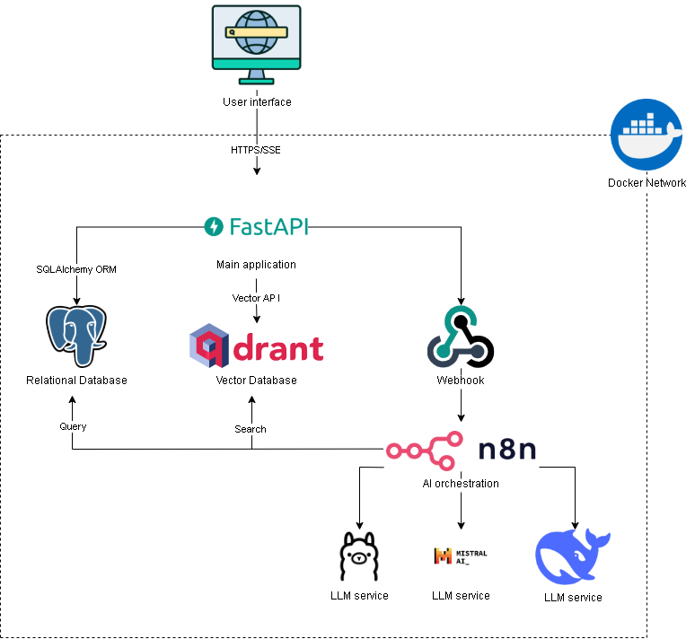
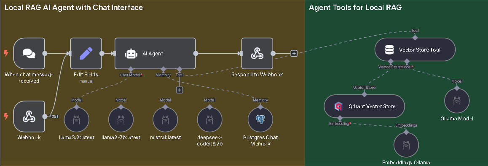

# AI-Powered Book Recommendation & Retrieval System


<p align="center">
  
</p>

> **Context-Aware RAG System with Hybrid Search & Local Inference**
>
> A production-ready implementation of a Retrieval-Augmented Generation (RAG) pipeline designed for low-latency, privacy-focused book recommendations. It leverages **Hybrid Search** (Dense + Sparse) and **Agentic Workflows** to deliver precise results without relying on external APIs.

> 📖 **Read the Full Thesis:** For a deep dive into the theoretical background, architectural decisions, and detailed performance benchmarks, please refer to the [Project Thesis (PDF)](docs/AI_Book_Recommendation_Thesis.pdf).

---

## 🏗 System Architecture

The system is architected as a set of containerized microservices, orchestrated to handle the full RAG lifecycle.

<p align="center">
  
  <br>
  <i>Figure 1: High-Level System Architecture & Data Flow</i>
</p>

### Agent Orchestration Logic
While the architecture provides the structure, the core intelligence lies in the **N8N Agent Workflow**. The diagram below illustrates how the agent handles query intent, tools execution, and memory management.

<p align="center">
  
  <br>
  <i>Figure 2: Detailed RAG Workflow & Tool Chaining in N8N</i>
</p>

---

## 🛠 Engineering Decisions & Tech Stack

| Component | Technology | Rationale / Trade-offs |
| :--- | :--- | :--- |
| **Backend Core** | **FastAPI** | Selected for high-performance AsyncIO handling and automatic OpenAPI documentation. |
| **Vector Engine** | **Qdrant** | Chosen over Milvus for its lower resource footprint and superior HNSW indexing performance in local environments. |
| **Database** | **PostgreSQL** | Provides robust relational data integrity for book metadata and structured filtering (e.g., Year, Author). |
| **LLM Runtime** | **Ollama** | Enables efficient local inference with hardware acceleration. Removes dependency on OpenAI/Anthropic APIs. |
| **Embedding** | **Nomic-Embed** | Utilizing `nomic-embed-text` (v1.5) provides better semantic clustering than `all-MiniLM-L6-v2` for long-context retrieval. |
| **Orchestrator** | **N8N** | Decouples complex agent logic from application code, allowing for visual debugging of the RAG chain. |

---

## 📊 Benchmark & Performance Analysis

Extensive benchmarking was conducted to determine the optimal Local LLM for this specific RAG task. The trade-off analysis focuses on **Latency vs. Generation Quality**.

**Test Environment:** Docker Container, RTX 3080 Laptop (16GB VRAM).

| Model | Success Rate | Avg Latency (ms) | P95 Latency (ms) | Verdict |
| :--- | :---: | :---: | :---: | :--- |
| **Llama 3.2 (3B)** | **100%** | **5,201** | **7,555** | **🏆 Selected (Best Balance)** |
| Mistral (7B) | 100% | 6,943 | 11,516 | High reasoning, higher latency |
| Deepseek-Coder | 100% | 6,760 | 13,257 | Good for code, poor for chat |
| Llama 2 (7B) | 100% | 9,602 | 13,360 | Legacy, deprecated |

*Full benchmark data and methodology available in `benchmark/` directory.*

---

## 📂 Project Structure

Organized following **Clean Architecture** principles to separate concerns:

```text
ai-book-rag/
├── app/                  # Application Core
│   ├── core/             # Settings & DB Connections
│   ├── models/           # SQLAlchemy Data Models
│   ├── routers/          # API Endpoints
│   └── services/         # Business Logic (Search, RAG)
├── assets/               # 📸 Images & Diagrams
├── benchmark/            # Performance Analysis Tools & Logs
├── database/             # Data Management
│   ├── seed.py           # Data Seeding Script
│   └── setup.py          # Schema Migration
├── docs/                 # 📄 Project Documentation & Thesis
├── docker/               # Docker configurations
├── workflows/            # N8N Agent Logic (JSON)
├── docker-compose.yml    # Infrastructure Definition
└── requirements.txt      # Python Dependencies

```

---

## 🚀 Installation & Setup

### Prerequisites

* Docker & Docker Compose
* (Optional) NVIDIA Container Toolkit for GPU acceleration.

### Step-by-Step

**1. Clone the repository:**

```bash
git clone [https://github.com/haise-dev/ai-book-rag.git](https://github.com/haise-dev/ai-book-rag.git)
cd ai-book-rag

```

**2. Configure Environment:**

```bash
cp .env.example .env
# Edit .env to set your database credentials

```

**3. Start the Stack:**

```bash
docker-compose up -d

```

> **Note:** The first launch triggers the `ollama-init` service, which automatically pulls `llama3.2` and `nomic-embed-text`. This may take a few minutes.

**4. Seed the Database:**
Populate the system with the provided dataset:

```bash
docker-compose exec book-web python database/seed.py

```

### Access Points

* **Web Interface:** `http://localhost:8000`
* **API Documentation:** `http://localhost:8000/docs`
* **N8N Workflow Editor:** `http://localhost:5678`

---

## 🔮 Future Roadmap

* [ ] **RRF Implementation:** Merge sparse and dense vector scores using Reciprocal Rank Fusion for better ranking.
* [ ] **Evaluation Pipeline:** Integrate **Ragas** to programmatically score Context Precision and Answer Relevance.
* [ ] **Frontend Migration:** Move from Jinja2 templates to a React/Next.js client.

---

**Author:** Pham Hoang Duong

**License:** MIT
